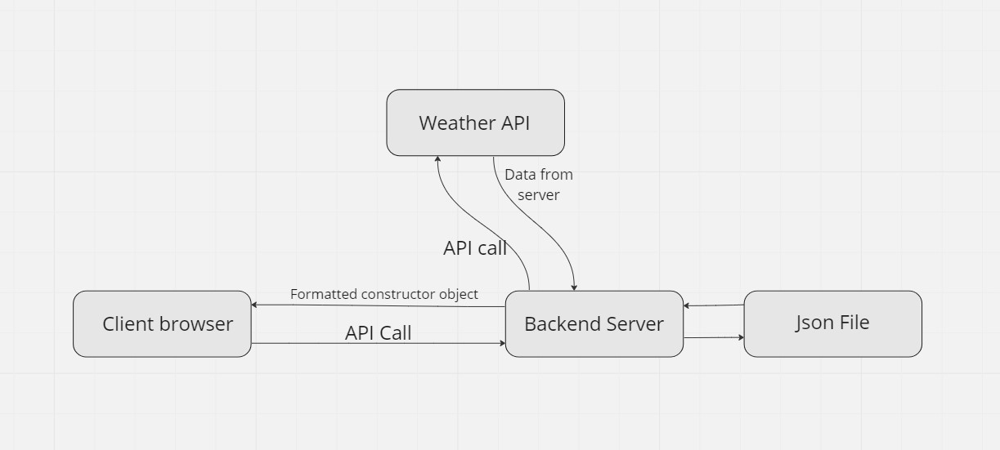

# City Explorer

**Author**: Martin Hansen
**Version**: 1.0.1

## Overview
<!-- Provide a high level overview of what this application is and why you are building it, beyond the fact that it's an assignment for this class. (i.e. What's your problem domain?) -->

## Architecture
<!-- Provide a detailed description of the application design. What technologies (languages, libraries, etc) you're using, and any other relevant design information. -->

## Change Log

11-15-2001 1am - Application Now has a functional search bar and output felid.

## Credit and Collaborations
<!-- Give credit (and a link) to other people or resources that helped you build this application. -->
Time Estimates
For each of the lab features, make an estimate of the time it will take you to complete the feature, and record your start and finish times for that feature:

### Name of feature: api call

Estimate of time needed to complete: 3hr

Start time: 11pm

Finish time: 12pm

Actual time needed to complete: 1hr

### Name of feature: map

Estimate of time needed to complete: 1hr

Start time: 12:30

Finish time: 1:15

Actual time needed to complete: 45 min
